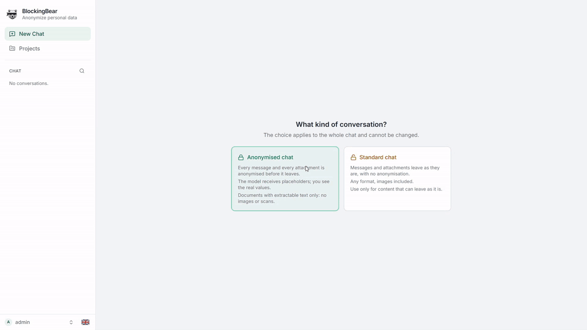

<p align="center">
  
</p>

<h1 align="center">BlockingBear</h1>

<p align="center"><strong>A self-hosted chat for any LLM, with local anonymization built in.</strong></p>
<p align="center">For a non-technical explanation, see the <a href="https://blockingbear.com/">website</a>.</p>

<p align="center">
  <a href="LICENSE"></a>
  <a href="https://github.com/GDP-Analytics-official/blockingbear/actions/workflows/deployment-contract.yml"></a>
  
  
  
  <a href="https://openrouter.ai"></a>
</p>

Stop sending personal and company data to LLMs. The AI models run in the cloud, through OpenRouter (account needed). BlockingBear is the part that stays on your server: it takes the personal data out of text and documents **before** the request reaches the model provider, and writes it back into the answer. The result is a normal AI chat - the model just never gets confidential data.

<p align="center">
  
</p>

<p align="center">
  <a href="#why-this-project">Why</a> ·
  <a href="#what-you-get">What you get</a> ·
  <a href="#supported-deployment">Deployment</a> ·
  <a href="#quick-start">Quick start</a> ·
  <a href="#first-start-setup-wizard">Setup wizard</a> ·
  <a href="#what-happens-to-an-uploaded-file">File flow</a> ·
  <a href="#documentation">Docs</a> ·
  <a href="#licence">Licence</a> ·
  <a href="#support">Support</a>
</p>


## Why this project

There are two ways to bring AI into a company, and each gives up something. BlockingBear adds a third: **use the commercial models without giving them your data.**

| | Run the models in-house | Use the commercial models | **BlockingBear** |
| --- | :---: | :---: | :---: |
| State-of-the-art models | ❌ | ✅ | ✅ |
| Personal data never reaches the model provider | ✅ | ❌ | ✅ |
| Works on text **and** documents | ✅ | ✅ | ✅ |
| Infrastructure to host | GPUs and the people to keep them alive | none | one container stack, CPU is enough |

In an anonymized chat the request is anonymized on your own machine before it reaches the model provider, and the answer comes back with the real values restored in place, for both text and documents. You get the state of the art, nothing but placeholders reaches the model provider, and the only piece you host is the anonymization layer.


## Who is this for

You have probably been there. A contract, a customer email, a payslip, a medical report is open on your screen, you paste it into the chat and, a second before pressing Enter, you stop: *there is a real person in this text*. A client's name, your company's VAT number, an employee's tax code, an IBAN, a card number, a home address. So you either strip them out by hand, one by one, or you send it anyway and hope.

BlockingBear is for the companies and the people who want to stop making that choice. Law and accounting firms, HR and finance teams, banks, doctors, consultants, public offices, anyone whose daily work is made of other people's data and who would like to use the best models on it without handing that data over. You keep using a normal chat. In an anonymized chat you can review of the anonymized text and documents before they leave. The administrator can decide whether to force all chats to be anonymized or not.


## Agentic capabilities

The models are not just a request to OpenRouter and a reply. Each one comes with tools, and the tools run on your machine.

🧪 **A code interpreter next to your files.** Ask for a pivot on the spreadsheet you uploaded, a chart, a cleaned-up CSV, a rebuilt PDF: the model writes Python and runs it in a Docker sandbox on your machine, with the conversation files copied into a private tmpfs workspace. One fresh container per conversation, no network, destroyed when the chat goes idle. In anonymized chats the model only sees the anonymized documents.

🌐 **Web search that keeps the anonymization.** Two tools, `web_search` and `read_page`, the model decides what to search and which pages to open. Browsing runs through a local, headless Camoufox browser, not through a search API of the model provider. Searching for `ORG_1` returns nothing, so the query is de-anonymized on your machine at the moment it hits the search engine, and every page that comes back is pushed through the full anonymization pipeline before the model reads it. The search engine receives the real terms, as it would if you typed them yourself; the model provider gets tags, not names. The engine is DuckDuckGo by default, which does not track users or build profiles; the administrator can point the browser at a different engine with `BLOCKINGBEAR_WEB_SEARCH_URL`, or disable web search for every chat from Settings.


## Supported deployment

The application is deployed only through Docker Compose. Host-level Python, Node and
bare-metal application installations are not supported.

| Platform | Compute path |
| --- | --- |
| Native Linux | CPU or NVIDIA GPU |
| Windows 10/11 with Docker Desktop and WSL2 | CPU or NVIDIA GPU |
| macOS with Docker Desktop | CPU; Metal GPU passthrough is unavailable |
| AMD GPU | CPU path; ROCm is not supported yet |

Docker Compose 2.23.1 or newer is required. The PII checkpoint is downloaded after the
clone and is intentionally excluded from Git.

### Quick start

The fastest way is to let your coding agent (Claude Code, Codex, Cursor, …) do the
installation. Open it on the machine that will run BlockingBear and paste:

```text
Install this repo for me: https://github.com/GDP-Analytics-official/blockingbear
```

The agent finds [AGENTS.md](AGENTS.md) in the repository and follows the deterministic
deployment contract, keeping you informed during downloads and builds.

For a manual installation:

```bash
git clone https://github.com/GDP-Analytics-official/blockingbear.git
cd blockingbear
sh scripts/init-env.sh
sh scripts/preflight.sh
# apply every printed correction and repeat preflight until it says Ready
# then run every build/start command printed by preflight
sh scripts/verify.sh
```

Preflight selects CPU or NVIDIA, validates Docker and prints the required sandbox
configuration. Verify performs real PII inference and sandbox execution; healthy
containers alone do not prove a working installation.

Windows users first install
[Docker Desktop](https://docs.docker.com/desktop/setup/install/windows-install/), enable
their WSL2 distro under Settings → Resources → WSL Integration, and run the commands from
that distro. macOS users install
[Docker Desktop for Mac](https://docs.docker.com/desktop/setup/install/mac-install/) for
Apple silicon or Intel and wait for **Engine running** before starting. The detailed
platform procedure is in
[Container deployment](docs/DEPLOYMENT.md).

### First start: setup wizard

Open `http://<machine-address>`. Until the setup wizard has been completed, the sign-in
page shows it:

1. Interface language.
2. OpenRouter **Management API Key**, created in your own browser at
   <https://openrouter.ai/settings/management-keys>. It is not a normal inference key: it
   lets BlockingBear create a separate inference key for every user, apply individual
   spending limits and show cost analytics. The wizard verifies it with OpenRouter and
   rejects inference keys.
3. Password of the `admin` account. Its personal OpenRouter key is created at the same
   time.
4. Categories of personal data to anonymize for every user.
5. Optionally, the first terms to always anonymize for every user (company name, names
   of key people).
6. Chat rules: whether every chat must be anonymized, or users may also open standard
   chats whose content leaves as it is (the default), and whether models without Zero
   Data Retention providers may be used. Standard chats send personal data to the
   provider.
7. Optionally, the default chat model for every user, with its initial options.
8. Optionally, which models non-administrator users can see and pick: the whole
   catalogue or a selected list (the default model is always included).

Every choice can be changed later: the Management API Key from the **API keys** admin
page, everything else from Settings. The wizard does not sign in: once completed, the
administrator logs in with the chosen password.

> [!IMPORTANT]
> Complete the wizard immediately after the first start: until it is completed, anyone who
> reaches the sign-in page can complete it and become the administrator.

> [!CAUTION]
> Do not place the Management API Key in `.env`, a terminal command, an issue or an LLM
> conversation. It is stored in `data/openrouter_management.key` and can be replaced from
> the **API keys** admin page. Details: [OpenRouter configuration](docs/OPENROUTER.md).

### Sandbox security disclosure

> [!WARNING]
> The required code interpreter gives the backend access to the Docker Engine socket. On
> native Linux this is effectively root-equivalent on the host. Docker Desktop adds a VM
> boundary on Windows and macOS, but the backend can still control that Engine and access
> paths shared with Docker Desktop.
>
> Sandbox containers themselves have no network, use private tmpfs workspaces and receive
> conversation files through controlled streams. Read the full
> [sandbox architecture and security model](docs/SANDBOX.md) before operating the service.

## What happens to an uploaded file

1. The local engine detects PII using the model, regex and checksum validation.
2. The original and protected copy remain on local storage; the decoding registry is
   stored in PostgreSQL.
3. The review interface shows original and protected versions side by side.
4. Manual corrections re-create the protected file from the original without rerunning
   the model.
5. Once you confirm the protected copy, the file becomes available to the chats of that
   project.
6. Model replies and supported generated files are restored locally before users see or
   download them.

When a project registry learns new values, older files are marked out of alignment and
can be re-redacted with the current registry.

## Documentation

- [blockingbear.com](https://blockingbear.com/) — non-technical overview of what BlockingBear does and who it is for
- [Container deployment](docs/DEPLOYMENT.md) — Linux, Windows/WSL2, macOS, CPU and NVIDIA
- [OpenRouter configuration](docs/OPENROUTER.md) — Management API Key and per-user inference keys
- [Troubleshooting](docs/TROUBLESHOOTING.md) — symptoms, causes and corrections
- [Operations](docs/OPERATIONS.md) — start, stop, updates and backups
- [Sandbox](docs/SANDBOX.md) — isolation design and Docker socket security
- [Development and tests](docs/DEVELOPMENT.md) — repository layout and contributor tests
- [Security policy](SECURITY.md) — reporting vulnerabilities
- [Contributing](CONTRIBUTING.md) — contribution and DCO requirements

## Licence

BlockingBear is free software released under the
**GNU Affero General Public License v3.0** ([LICENSE](LICENSE)). If a modified version is
made available to users over a network, those users must be offered the corresponding
source under the same licence.

PyMuPDF and the YOLO11n signature detector are also AGPL-3.0 components linked into the
application. [NOTICE](NOTICE) lists all third-party components and licences.

Copyright © 2026 **GDP Analytics S.r.l.**

## Support

For deployment assistance, support or customization, contact
**info@gdpanalytics.com** or send a request through the contact form on the
[website](https://blockingbear.com/).
